# Autour des Fractales

## Description

Ce projet fournit une implantation de base pour votre projet de SAÉ S3.A.01.
Pour pouvoir développer votre propre implantation de ce projet, vous devez
en créer une **divergence** en cliquant sur le bouton `Fork` en haut à droite
de cette page.

Lorsque ce sera fait, vous pourrez inviter les membres de votre groupe en tant
que *Developer* pour vous permettre de travailler ensemble sur ce projet.

## Exécution

Pour exécuter l'application, vous pouvez exécuter la tâche `run` de *Gradle*.
Afin de vous permettre de facilement contrôler la création des fractales depuis
la ligne de commande, la classe `fr.univartois.butinfo.fractals.Fractals` (qui
définit la méthode `main`) gère déjà pour vous les arguments de cette ligne
de commande (les options données sont stockées dans les attributs de cette
classe).
Vous pouvez en particulier l'exécuter à l'aide des options suivantes :

```
-f,--fractal-name  <name>      Spécifie le nom de la fractale à générer.
-h,--height        <pixels>    Spécifie la hauteur de l'image à générer.
-n,--nb-iterations <integer>   Spécifie le nombre d'itérations à appliquer pour générer la fractale.
-o,--output        <file>      Spécifie le nom du fichier dans lequel la fractale doit être sauvegardée.
-p,--palette-name  <name>      Spécifie le nom de la palette de couleurs à appliquer lors de la génération.
-s,--scale         <ratio>     Spécifie l'échelle à appliquer sur l'image.
-w,--width         <pixels>    Spécifie la largeur de l'image à générer.
-x,--focus-x       <real>      Spécifie le point central de l'image sur l'axe des abscisses.
-y,--focus-y       <real>      Spécifie le point central de l'image sur l'axe des ordonnées.
```

Évidemment, vous devrez compléter la classe `Fractals` pour qu'il se passe
quelque chose lors de l'exécution !

## JAR exécutable

Vous avez également la possibilité de générer un JAR à l'aide de *Gradle*, en
exécutant la tâche `jar`.
Ce JAR constitue un exécutable que vous pouvez facilement distribuer, et que
vous pouvez exécuter de la manière suivante :

```bash
java -jar build/libs/sae-2022-2023.jar --help
```

Les options acceptées par ce JAR sont les mêmes que celles décrites dans la
section précédente.

## To do 
- Le code source de votre bibliothèque sur GitLab, dont vous déposerez le lien sur Moodle.
- Le diagramme de classes de votre application, à la racine de votre dépôt GitLab, idéalement en
intégrant dans le README de votre projet un diagramme PlantUML.
- Différents scripts permettant d’exécuter votre application, que vous ajouterez dans un répertoire
scripts à la racine de votre dépôt GitLab (voir la section dédiée plus loin).
- Un rapport (au format Markdown) décrivant le travail réalisé par chacun, ainsi que la justification
du choix des patrons de conception et des structures de données utilisées. Vous y indiquerez
également en quoi les différentes ressources de votre formation vous ont aidés à réaliser ce
projet, et les difficultés que vous avez rencontrées pendant son développement. Ce rapport
devra également être ajouté à la racine de votre dépôt GitLab.

## Diagramme UML

```plantuml
@startuml

package fr.univartois.butinfo.fractals {
    class Fractals
}

class Fractals {
    - help : boolean
    - width : int
    - height : int
    - foxusX : double
    - focusXString : String
    - foxusY : double
    - focusYString : String
    - scale : double
    - scaleString : String
    - fractaleName : String
    - nbIterations : int
    - paletteName : String
    - outputFile : String
    - classParser : ClasseParser<Fractals>
    - Fractals()

    + parseCliArguments(String[]) 
    + usage() : void 
    + buildFractals() : void 
    + {static} main(String[]) : void
}

package fr.univartois.butinfo.fractals.complex {
    class Complex
    class ComplexPlan
    class AdaptateurComplex
    class ComplexPlanTranslationDecorator
    class ComplexPlanZoomDecorator
    abstract class ComplexPlanDecorated
    interface IPlanPoint
    interface IComplex
    interface IComplexPlan
}

abstract class ComplexPlanDecorated {
      + decorated : IComplex
      # height : int
      # width : int

      # ComplexPlanDecorated(height,width)
      + asComplex(int,int) : IComplex;
}

class AdaptateurComplex implements IPlanPoint {
      - complex :IComplex   
    
      + AdaptateurComplex(IComplex)
      + X() : double
      + Y() : double
      + distance(IPlanPoint) : double
      + convertirEnIComplex() : IComplex
}

interface IPlanPoint {
      + X() : double
      + Y() : double
      + distance(IPlanPoint) : double
      + convertirEnIComplex() : IComplex
}

class Complex implements IComplex {
    - re : double
    - im : double 

    + Complexe(double,double)
    + getImaginaryPart() : double
    + abs() : double
    + negate() : IComplex
    + conjugate() : IComplex
    + add(IComplex) : IComplex
    + subtract(IComplex) : IComplex
    + multiply(double) : IComplex
    + multiply(IComplex) : IComplex
    + divide(IComplex) : IComplex
    + equals(Object) : boolean
    + hasCode() : int 
    + toString() : String
}

interface IComplex {
    + getRealPart() : double
    + getImaginaryPart() : double 
    + abs() : double
    + negate() : IComplex
    + conjugate() : IComplex
    + add(IComplex) : IComplex
    + subtract(IComplex) : IComplex
    + multiply(double) : IComplex
    + multiply(IComplex) : IComplex
    + divide(IComplex) : IComplex
}

interface IComplexPlan{
   +  asComplex(int,int) : IComplex;
}

class ComplexPlanZoomDecorator extends ComplexPlanDecorated {
    -  constant : double

    + ComplexPlanZoomDecorator(double)
    + asComplex(int,int) : IComplex
}

class ComplexPlanTranslationDecorator extends ComplexPlanDecorated {
    - constant : IComplex

    + ComplexPlanTranslationDecorator(double)
    + asComplex(int,int) : IComplex
}

class ComplexPlan {
     - height : int
     - width : int 
     +ComplexPlanTranslationDecorator(double,double,height,width)
     + asComplex(int,int) : IComplex
}

package fr.univartois.butinfo.fractals.color {
    class ColorPalette
    interface IColorPaletteStrategy
    abstract class MaskColorPaletteDecorator
}

class  ColorPalette {
    - ITERATION_NUMBER_MAX : int
    - colorPaletteStrategy : IColorPaletteStrategy

    + ColorPalette(int) 
    + getColor(int) : Color
}

interface IColorPaletteStrategy {
    + getColor(int,int) : Color
}

abstract class MaskColorPaletteDecorator implements IColorPaletteStrategy{
   # decorated : IColorPaletteStrategy 

   # MaskColorPaletteDecorator(IColorPaletteStrategy)
}

package fr.univartois.butinfo.fractals.color.strategies {
          class BlueColorPaletteStrategy
          class GrayColorPaletteStrategy
          class GreenColorPaletteStrategy
          class RedColorPaletteStrategy
}

class BlueColorPaletteStrategy implements IColorPaletteStrategy
{
     - {static} TINT_MAX : int
     + getColor(int, int) : Color
}

class GrayColorPaletteStrategy implements IColorPaletteStrategy
{
     - {static final} TINT_MAX : int
     + getColor(int, int) : Color
}

class GreenColorPaletteStrategy implements IColorPaletteStrategy
{
     - {static final} TINT_MAX : int
     + getColor(int, int) : Color
}

class RedColorPaletteStrategy implements IColorPaletteStrategy
{
     - {static final} TINT_MAX : int
     + getColor(int, int) : Color
}

package fr.univartois.butinfo.fractals.color.decorators {
          class OnlyBlueDecorator
          class OnlyGreenDecorator
          class OnlyRedDecorator
}

class OnlyBlueDecorator extends MaskColorPaletteDecorator {
   
    +  OnlyBlueDecorator(IColorPaletteStrategy)
    +  getColor(int, int) : Color
}

class OnlyGreenDecorator extends MaskColorPaletteDecorator {
   
    +  OnlyGreenDecorator(IColorPaletteStrategy)
    +  getColor(int, int) : Color
}

class OnlyRedDecorator extends MaskColorPaletteDecorator {
   
    +  OnlyRedDecorator(IColorPaletteStrategy)
    +  getColor(int, int) : Color
}

package fr.univartois.butinfo.fractals.image {
    class Pixel
    interface IFractalImage
    class BufferedImageAdaptor
    class FractalImage
    class FractalImageBuilder
}

class FractalImageBuilder {
     - height : int
     - width : int
     - scale : double
     - centralPoint : Pixel
     - sequence : Sequence
     - fractalName : String
     - colorPalette : ColorPalette
     - file : String
     - FractalImageBuilder()

     + {static} FractalImageBuilder()
     + getHeight : int
     + withHeight(int) : FractalImageBuilder
     + getWidth() : int
     + withWidth(int) : FractalImageBuilder
     + getScale() : double
     + withScale(double) : FractalImageBuilder
     + getCentralPoint() : Pixel
     + withCentralPoint(Pixel) : FractalImageBuilder
     + getSequence() : String
     + withSequence(String) : FractalImageBuilder
     + getColorPalette() : ColorPalette
     + withColorPalette(ColorPalette) : FractalImageBuilder
     + getFile() : String
     + withFile(String) : FractalImageBuilder
     + build() : FractalImage
}

class FractalImage {
     - height : int
     - width : int
     - scale : double
     - centralPoint : Pixel
     - sequence : Sequence
     - colorPalette : ColorPalette
     - file : String

     + FractalImage(FractalImageBuilder)
     + createImage(int) : void
}

class BufferedImageAdaptor implements IFractalImage {
    - bufferedimage : BufferedImage
    + pixel : Pixel
   
    + BufferedImageAdaptor(BufferedImage)
    + getHeight() : int
    + getWidt() : int
    + getPixel(row,column) : Pixel
    + saveAs(String) : void
    + setColor(Color,row;column) : void
}

class Pixel {
    - image : IFractalImage
    - row : int
    - column : int

    + Pixel(IFractalImage,row,int)
    + getRow() : int
    + getColumn() : int
    + getImage() : IFractalImage
    + setColor(Color) : void
}

interface IFractalImage{
    + getHeight() : int
    + getWidt() : int
    + getPixel(row,column) : int
    + saveAs(String) : void
    + setColor(Color,row;column) : void
}

Pixel o-- "1" IFractalImage
FractalImage o-- "1" Sequence
FractalImageBuilder o-- "1" Sequence
BufferedImageAdaptor o-- "1" Pixel

package fr.univartois.butinfo.fractals.sequences{
    interface INextTerm
    class Sequence
    class SequenceIterator
    class JuliaGeneralizationNextTerm
    class JuliaNextTerm
    class MandelbrotGeneralizationNextTerm
    class MandelbrotNextTerm
}

class JuliaGeneralizationNextTerm implements INextTerm{
     - firstTerm : IComplex
     - presentTerm : IComplex
     - c : IComplex
     - binaryOperator : BinaryOperator<IComplex>
     - sequence : Sequence
     + JuliaGeneralizationNextTerm(IComplex,IComplex, BinaryOperator<IComplex>)
     + calculateNextTerm(IComplex) : IComplex
     + setFirstTerm(IComplex) : void
     + setPresentTerm(IComplex) : void
}

class JuliaNextTerm implements INextTerm {
       + firstTerm : IComplex
       + presentTerm : IComplex
       + z : IComplex
       + c : IComplex
    
       + JuliaNextTerm(IComplex,IComplex)
       + calculateNextTerm(IComplex) : IComplex
       + setFirstTerm(IComplex) : void
       + setPresentTerm(IComplex) : void
       + getPresentTerm() : IComplex      
       + getFirstTerm() : IComplex
}

class MandelbrotGeneralizationNextTerm implements INextTerm {
       - firstTerm : IComplex
       - presentTerm : IComplex
       - z : IComplex
       - sequence : Sequence
       - binaryOperator : BinaryOperator<IComplex>

       + MandelbrotGeneralizationNextTerm(IComplex,IComplex, BinaryOperator<IComplex>)
       + calculateNextTerm(IComplex) : IComplex
       + setFirstTerm(IComplex) : void
       + setPresentTerm(IComplex) : void
       + getPresentTerm() : IComplex      
       + getFirstTerm() : IComplex
}

class MandelbrotNextTerm implements INextTerm {
       - firstTerm : IComplex
       - presentTerm : IComplex
       - z : IComplex
       - sequence : Sequence 

       + MandelbrotNextTerm (IComplex,IComplex)
       + calculateNextTerm(IComplex) : IComplex
       + setFirstTerm(IComplex) : void
       + setPresentTerm(IComplex) : void
       + getPresentTerm() : IComplex      
       + getFirstTerm() : IComplex
}  
     
class Sequence  implements Iterable {
    - nextTerm : INextTerm
    - firstElement : IComplex
    - presentTerm : IComplex

    + getPresentTerm() : IComplex
    + setPresentTerm(IComplex) : void
    + iterator() : Iterator<IComplex>
    + getNextTerm() : INextTerm
    + setNextTerm : void
    + getFirstTerm() : IComplex
    + setFirstTerm(IComplex) : void
}

interface INextTerm {
     + setFirstTerm(IComplex) : void
     + setPresentTerm(IComplex) : void
     + calculateNextTerm(IComplex) : IComplex
     + getPresentTerm() : IComplex
     + getFirstTerm() : IComplex
}

class SequenceIterator implements Iterator {
    - {final} sequence : Sequence
   
    + SequenceIterator(Sequence)
    + hasNext() : boolean
    + next() : IComplex
}

SequenceIterator o-- "1" Sequence
JuliaGeneralizationNextTerm  o-- "1" Sequence
MandelbrotGeneralizationNextTerm o-- "1" Sequence
JuliaNextTerm  o-- "1" Sequence
MandelbrotNextTerm  o-- "1" Sequence
SequenceIterator o-- "1" IComplex
Sequence o-- "1" IComplex

package fr.univartois.butinfo.fractals.sequences.chaotic{
    interface ISequenceChaotique
    class SequenceChaotique
    class SequenceChaotiqueIterator
    class Feigenbaum
    class Circulaire
}

interface ISequenceChaotique {
     + getNext(IPlanPoint) : double
}

abstract class SequenceChaotique implements ISequenceChaotique
abstract class SequenceChaotique implements Iterable {
   - premier : IPlanPoint
   - nbMaxIteration : int
    
   + SequenceChaotique(IPlanPoint, int)
   + iterator() : Iterator<IPlanPoint>
}

class SequenceChaotiqueIterator implements Iterator {
      - precedent: IPlanPoint
      - nbMaxIteration : int
      - nbIteration : int
      - suiteChaotique : ISequenceChaotique
      
      + SequenceChaotiqueIterator(ISequenceChaotique , int, IPlanPoint)
      + hasNext() : boolean
      + next() : boolean 
}

class Feigenbaum extends SequenceChaotique 
class Feigenbaum implements ISequenceChaotique {
     + Feigenbaum(IPlanPoint, int)
     + getNext(IPlanPoint) : double
}

class Circulaire extends SequenceChaotique 
class Circulaire implements ISequenceChaotique {
     + Circualire(IPlanPoint, int)
     + getNext(IPlanPoint) : double
}

package fr.univartois.butinfo.fractals.figure{
    interface IFigure
    class Rectangle
    class Circle
    class Ellipse
    class Polyligne
    class Line
}

interface IFigure {
   + toString() : String
}

class Rectangle implements IFigure{
   - x : int 
   - y : int
   - width : int
   - height : int 
   - rx : int 
   - ry : int
   - fill : String
   - stroke : String
   - strokeWidth : int
   - decorated : IFigure
   
   + Rectangle(int, int, int, int, int, int, String, String, int) 
   + ToString : String
}

class Circle implements IFigure{
   - r : int 
   - cx : int
   - cy : int
   - fill : String
   - stroke : String
   - strokeWidth : int
   - decorated : IFigure
   
   + Circle(int, int, int, String, String, int) 
   + ToString : String
}

class Ellipse implements IFigure{
   - rx : int 
   - ry : int
   - cx : int
   - cy : int
   - fill : String
   - stroke : String
   - strokeWidth : int
   - decorated : IFigure
   
   + Ellipse(int,int, int, int, String, String, int) 
   + ToString : String
}

class Line implements IFigure{
   - x1 : int 
   - x2 : int
   - y1 : int
   - y2 : int
   - fill : String
   - stroke : String
   - strokeWidth : int
   - decorated : IFigure
   
   + Line(int, int, int, String, String, int) 
   + ToString : String
}

class Polyligne implements IFigure {
   - stroke : String
   - strokeWidth : int
   - decorated : IFigure 

   - Polyligne(String)
   - ToString() : String
}

package fr.univartois.butinfo.fractals.figure.composite {   
    interface IFigureComposite
    class FigureComposite
    abstract class AbstractFigure 
}

interface IFigureComposite {
     + figureString(String) : String
}

class  FigureComposite implements IFigureComposite {
   +  figures : List
   
   + figureString(String) : String
   + add(IFigureComposite) : void
   + remove(IFigureComposite) : void
}

abstract class AbstractFigure implements IFigureComposite {
   - rectangle : Rectangle
   - circle : Circle 
   - ellipse : Ellipse
   - polyligne : Polyligne
   - nom : String 
   - {static} main(String[]) : void
   # {static} create() : String
   #  rectangle() : String
   #  circle() : String
   #  ellipse() : String
   #  polyligne() : String
}

AbstractFigure o-- "1" Rectangle
AbstractFigure o-- "1" Circle
AbstractFigure o-- "1" Ellipse
AbstractFigure o-- "1" Polyligne

package fr.univartois.butinfo.fractals.figure.composite {   
    class FigureEchelleDecorator
    class FigureInclinaisonDecorator
    class FigureTranslationDecorator
    class FigureRotationDecorator
}

class FigureEchelleDecorator implements IFigure
{
   - x : int
   - y : int
 
   + FigureEchelleDecorator(int, int) 
   + ToString() : String
}

class FigureInclinaisonDecorator implements IFigure
{
   - x : int

   + ToString() : String
}

class FigureRotationDecorator implements IFigure
{
   - x : int
 
   + FigureRotationDecorator(int) 
   + ToString() : String
}

class FigureTranslationDecorator implements IFigure
{
   - x : int
   - y : int
 
   + FigureTranslationDecorator(int, int) 
   + ToString() : String
}

@enduml
```



## Rapport

### Les nombres complexes

__Implantation des opérations sur les nombres complexes__

Shahin s'est occupé de cette partie. Il n'a pas dû faire de choix.

Il a eu des difficultés pour la conception des différentes opérations.

__Implantation des opérations sur le plan complexe__

Shahin s'est occupé de cette partie. Il a choisi de faire la translation et le zoom à l'aide d'un *decorator* car il n'est pas obligatoire d'appliquer une translation ou un zoom. Il a aussi dû faire un adaptateur pour permettre de calculer la distance entre deux points et de convertir un point du plan en un objet de type `IComplex`.

C'est grâce à la formation qu'il a su choisir les patrons de conception. Plus précisement, le *design pattern*.

Enfin, il a eu des difficultés dans le conception des *decorators*.

### Suites complexes et fractales

__Généralités sur les suites__

Sébastien s'est occupé de cette partie. Pour la représentation de la suite, il a choisi de la faire à l'aide d'une *strategy* car elle permet de rendre interchangeables des algorithmes qui ont des rôles similaires. Effectivement, les suites sont toutes pareils, sauf au niveau du calcul du prochain terme. De plus, pour le parcours de la suite, il a décidé de le faire avec un *iterator* car il faut pouvoir passer du terme courant au terme suivant.

C'est grâce à la ressources de qualité de développement qu'il a pu identifier le patron de conception qu'il fallait utiliser.

Enfin, il a eu des difficultés à trouver le patron de conception. En effet, il pensais, au début, qu'il fallait faire un constructeur abstrait. Il a aussi eu des difficultés dans la conception de l'*iterator*.

__Ensembles de Julia__

Sébastien s'est occupé de cette partie. Il n'a pas du faire de choix.

__Ensemble de Mandelbrot__

Sébastien s'est occupé de cette partie. Il n'a pas du faire de choix.

__Ensemble de Julia et de Mandelbrot généralisés__

Sébastien s'est occupé de cette partie. Il n'a pas du faire de choix.

### Choix des couleurs

Théo et Sébastien se sont occupés de cette partie. Pour pouvoir représenter les différentes palettes de couleurs, ils ont choisi d'implémanter une *strategy*. Effectivement, plusieurs choix de palettes doivent être possible. Pour ce qui est du masque de couleurs, ils ont choisi de mettre un place un *decorator* car il ne faut pas forcément qu'un masque soit appliqué sur la palette.

C'est grâce à la ressource de qualité de développement que Théo et Sébastien ont pu faire ces choix.

Enfin, ils ont eu des difficultés à trouver le dernier patron de conception. Effectivement, ils pensaient, au début, qu'il fallait faire un *composite*.

### Suites chaotiques et diagrammes de bifurcation

__Suites chaotiques__

Shahin s'est occupé de cette partie. Il a implémenté la suite pour représenter l'attracteur *Feigenbaum* et la suite circulaire. Il a aussi implémenté un itérateur pour parcourir successivement les suites chaotiques.

Il a choisi de faire un itérateur car il faut parcourir les termes comme cela a été fait pour les suites complexes.

C'est grâce à la ressource de qualité de développement qu'il a pu faire ces choix.

__Diagramme de bifurcation__

*Cette partie n'est pas finie.*

### Création d'images en Java

Théo s'est occupé de cette partie. Il a choisi, pour la manipulation des images, d'utiliser un *adaptator* pour permettre à des classes initialement incomptables de communiquer ensemble. Ici, on parle de l'interface `IFractalImage` et de la classe `BufferedImage`.

C'est grâce à la ressource de qualité de développement que Théo a pu faire ces choix.

### Génération des images

Sébastien s'est occupé de cette partie. Il a décidé de l'implémenter à l'aide d'un *builder* pour éviter qu'il n'y ait trop d'arguments dans le constructeur.

C'est grâce à la ressource de qualité de développement qu'il a pu faire ces choix. Plus spécifiquement, les deux diagrammes UML du cours.

Enfin, il a eu des difficultés à effectué cette partie. Effectivement, c'était la première fois qu'il faisait un *builder*.

### Figures et transformations géométriques

__Représentation des différentes figures__

Théo s'est occupé de cette partie. Il a fait un composite pour les figures car cela permet de traiter les différentes figures.

C'est grâce à la ressource de qualité de développement qu'il a pu déterminé le patron de conception qu'il fallait utiliser.

__Construction de fractales à partir de figures géométriques__

*Cette partie n'est pas finie.*

__Quelques fractales à base de figures géométriques__

*Cette partie n'est pas finie.*

__Génération des fractales__

*Cette partie n'est pas finie.*

### Scripts de lancement pour votre application

__La classe principale__

Sébastien s'est occupé de cette partie. Il n'a eu aucune difficulté à la faire et n'a pas dû faire de choix.

__Exécution de l'application__

Sébastien s'est occupé de cette partie. Il n'a eu aucune difficulté à la faire et n'a pas dû faire de choix.

__Scripts de lancement__

Sébastien s'est occupé de cette partie. Il n'a eu aucune difficulté à la faire et n'a pas dû faire de choix.

### Diagramme UML et rapport

Théo s'est occupé de mettre à jour, pour chaque jalon, le diagramme UML. De la même manière, Sébastien s'est occupé de mettre à jour le rapport.
